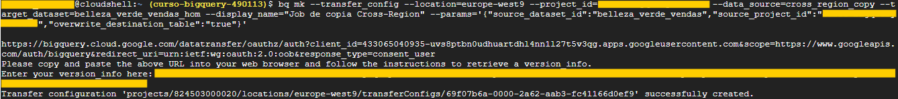

# BigQuery Study Notes

## Official Documentation & Resources
* **Official Google Cloud Documentation:** [BigQuery Docs](https://docs.cloud.google.com/bigquery/docs?hl=pt-br)
* **Recommended Reading:** [Google BigQuery: The Definitive Guide (O'Reilly)](https://www.amazon.com/Google-BigQuery-Definitive-Warehousing-Analytics/dp/1492044466)

---

## Course 4: Google BigQuery - Data Manipulation

### 1. Understanding Datasets

In the BigQuery hierarchy, a **Dataset** is a top-level container that is used to organize and control access to your tables and views.

* **Purpose:** Acts as a logical grouping for your data, allowing you to manage permissions, data location, and lifecycle policies at scale.
* **Scope:** Datasets are project-specific. A single Google Cloud Project can contain multiple datasets.
* **Data Location:** When creating a dataset, you must define a geographical location (e.g., `US`, `EU`, or specific regions). Once set, it cannot be changed, which is critical for compliance and latency optimization.

---

### 1.1 Dataset Creation Requirements and Restrictions

When naming and configuring a dataset in BigQuery, you must adhere to specific rules enforced by Google Cloud:

#### Naming Conventions
* **Uniqueness:** The dataset ID must be unique within the specific project.
* **Character Set:** Must contain letters (a-z, A-Z), numbers (0-9), or underscores (`_`).
* **Starting Character:** The name must start with a letter or an underscore.
* **Length:** Can be up to 1,024 characters long.
* **Case Sensitivity:** Dataset IDs are case-sensitive on some systems, but BigQuery generally treats them as case-sensitive for API calls.

#### Location & Restrictions
* **Immutability:** Once a dataset is created, you **cannot** change its location (e.g., from `US` to `EU`). To move data, you would need to export and re-import it or use Data Transfer Service.
* **Reserved Prefixes:** You cannot start a dataset name with `goog` or `google`, as these are reserved for system use.
* **Region Selection:** The choice of location (Multi-region vs. Region) affects performance, cost, and compliance with data sovereignty laws (like GDPR).

---

### 1.2 Creating a Dataset: Step-by-Step

After ensuring your dataset name and location meet the requirements mentioned above, follow these steps to create it via the Google Cloud Console:

1.  **Navigate to BigQuery:** In the Google Cloud Console, go to the BigQuery page.
2.  **Select your Project:** In the Explorer panel, select the project where you want to create the dataset.
3.  **Open Creation Menu:** Click on the **three dots (View actions)** next to your project ID and select **Create dataset**.
4.  **Configure Dataset ID:** Enter your unique ID (remembering the naming conventions).
5.  **Select Data Location:** Choose between a Multi-region (e.g., US, EU) or a specific Region (e.g., southamerica-east1 for São Paulo). 
    * *Note: Data location affects cost and latency.*
6.  **Set Expiration (Optional):** You can define a **Default table expiration**. This is useful for temporary or staging data, as BigQuery will automatically delete tables after the specified number of days.
7.  **Encryption:** By default, Google manages encryption. You can also choose Customer-Managed Encryption Keys (CMEK) for higher security requirements.
8.  **Finalize:** Click **Create Dataset**. The new dataset will now appear in your project's Explorer side panel.

---

### 1.3 Creating a Dataset via Google Cloud Shell (CLI)
The `bq` command-line tool is a powerful alternative to the Google Cloud Console, allowing for automation and faster resource management.

#### Step-by-Step via CLI:
1. **Open Cloud Shell:** Click the Cloud Shell icon in the top right of the Google Cloud Console.
2. **Execute the Create Command:** Use the `bq mk` command to create the resource.

**Command used in practice:**
```bash
bq --location=europe-west9 mk --dataset --description="conjunto de dados usando SHELL - homologação" belleza_verde_vendas_hom
```


**Parameters Explained:**
* **`bq`**: The BigQuery command-line tool.
* **`--location=europe-west9`**: Explicitly defines the data location (in this case, Paris).
* **`mk`**: Short for "make", the command used to create new resources.
* **`--dataset`**: Specifies that the resource type is a dataset.
* **`--description`**: Adds metadata to the dataset, essential for data governance and team collaboration.
* **`belleza_verde_vendas_hom`**: The unique ID assigned to the new dataset.

**Execution Feedback:**
Upon successful execution, the terminal returns a confirmation message:
`Dataset 'project-id:belleza_verde_vendas_hom' successfully created.`

**Why use the CLI alternative?**
* **Efficiency:** Faster execution for experienced users compared to navigating the GUI.
* **Governance:** Easier to standardize descriptions and locations through scripts.
* **Automation:** This command can be part of a larger bash script to provision entire environments (Dev, Homolog, Prod) automatically.

### 1.4 Inspecting and Managing Datasets via CLI

After creating a dataset, you can inspect its metadata and update its properties directly from the Cloud Shell using the following commands:

**A. Listing Datasets**
To see all datasets within your current project:

```bash
bq ls
```

**B. Viewing Dataset Details**
To see the specific configuration of a dataset (location, creation time, expiration):

```bash
bq show belleza_verde_vendas_hom
```

**C. Viewing Details in JSON Format**
For a more structured view (useful for automation or deep inspection), you can format the output:

```bash
bq show --format="prettyjson" belleza_verde_vendas_hom
```

> **Tip:** The JSON format reveals internal metadata that might be hidden in the standard summary view.

#### D. Updating Dataset Metadata
If you need to change properties like the description without deleting and recreating the dataset, use the update command:

**Command used in practice:**

bq update --description="Conjunto de dados usando SHELL -- Homologação v2" belleza_verde_vendas_hom

**Why use these commands?**
* **Verification:** bq ls and bq show ensure your resource was created with the correct parameters.
* **Flexibility:** bq update allows for adjustments without the risk of deleting data.
* **JSON Analysis:** prettyjson is essential for understanding how Google Cloud structures resource data internally.

## 2. Copying or Transferring Data

When you need to move data between different projects or regions, BigQuery provides a more robust method than a simple copy: the Data Transfer Service.

### 2.1 Cross-Project Data Transfer (`bq mk --transfer_config`)

The following command sets up an automated transfer job. In this specific case, it is configured to pull data from a source project into your local dataset.

**Updated Command:**
```bash
bq mk --transfer_config \
--project_id=curso-bigquery-490113 \
--data_source=cross_region_copy \
--target_dataset=belleza_verde_vendas_hom \
--display_name="Job de copia de conjunto de dados para Belleza Verde Hom" \
--params='{"source_dataset_id":"belleza_verde_vendas","source_project_id":"curso-bigquery-490113","overwrite_destination_table":"true"}'
```

### 2.2 Critical Observation: Source vs. Target
* **Target Project:** `curso-bigquery-490113` (Where the job is created and where the data will land).
* **Source Project:** `curso-bigquery-490113` (Where the original data currently exists).

### 2.3 Why use backslashes (`\`)?
The backslashes at the end of each line are used in the terminal to "escape" the newline character. This allows you to break a very long command into multiple lines, making it much easier to read and edit without breaking the execution.

### 2.4 Lessons Learned: Troubleshooting Data Transfers

The process of setting up a Cross-Region Data Transfer is a "rite of passage" for Data Engineers. Here are the key takeaways from this implementation:

#### 1. Identity & Security (The OAuth Ritual)
* **User Data vs. Application Data:** We learned that automated jobs need an identity. Using "User Data" with a "Desktop App" Client ID is the quickest way to authorize commands directly from the Cloud Shell.
* **Consent is Key:** The Google Cloud terminal provides an authorization URL. You must manually sign in and paste the `version_info` code back to grant the "handshake" between your user and the BigQuery service.

#### 2. The Precision of Project IDs
* **Typo Sensitivity:** A single missing digit in a `project_id` (like the "9" we missed earlier) results in a `Permission Denied` error. Always copy project IDs directly from the Google Cloud Console.

#### 3. Regional Awareness (The "CloudRegion" Error)
* **Cross-Region Logic:** Data cannot move between continents (`us-central1` to `europe-west9`) without explicit instructions. 
* **The Solution:** We must use the `--location` flag pointing to the **target region** (in this case, `europe-west9` for Paris) to orchestrate the transfer successfully.

#### 4. Cost Consciousness
* **Egress Fees:** Moving data across regions incurs small network fees (Data Egress). In student accounts, this is covered by free credits, but in production, it's a critical factor for architectural decisions.

> **Final Result:** The job is now registered and will handle the synchronization between the US source and the European target automatically.



### 2.5 Data Transfer via Console (GUI) and Direct Dataset Copy

After exploring the command-line approach, we move to the graphical interface. The BigQuery Console offers a more intuitive way to manage transfers and direct copies without writing code.

#### 2.5.1 Creating Transfers via the "Data Transfer" Tab
The Data Transfer Service (DTS) is accessible via the side menu and allows for highly customizable data pipelines.

* **Marketplace & Connectors:** DTS isn't limited to BigQuery. It supports over 200 sources, including YouTube, Salesforce, Oracle, TikTok, and Facebook.
* **The "Dataset Copy" Option:** To move data between BigQuery environments (like `vendas` to `vendas_dev`), we select "Dataset Copy".
* **Scheduling:** Unlike simple copies, DTS allows for scheduled runs (Daily, Weekly, or Custom). This is ideal for keeping Dev/Hom environments synchronized with Production automatically every 24 hours.
* **Monitoring:** Every job generates an execution log. Through the **Logs Explorer**, you can monitor the status (e.g., "Dispatched run") and verify if the data has successfully moved from the source project to the target project.


#### 2.5.2 Direct Dataset Copy (The "Quick" Method)
For immediate, one-time movements—such as populating the `vendas_prod` dataset—the console offers an even faster route:

1.  **Navigate to Source:** Select the source dataset (`belleza_verde_vendas`).
2.  **Action:** Click the "Copy" button at the top of the dataset panel.
3.  **Target:** Select the destination dataset and decide whether to "Overwrite destination table."
4.  **Result:** This creates a default-named job in the Transfer tab and executes immediately.

#### 2.5.3 Key Comparison: CLI vs. DTS UI vs. Direct Copy

| Feature | Cloud Shell (CLI) | Data Transfer (GUI) | Direct Copy (Button) |
| :--- | :--- | :--- | :--- |
| **Effort** | High (Scripting) | Medium (Forms) | Low (Clicks) |
| **Automation** | Highly Scriptable | Native Scheduling | One-time execution |
| **External Sources** | Limited | 200+ Connectors | BigQuery only |
| **Best For** | CI/CD Pipelines | Scheduled Syncs | Quick Ad-hoc copies |

> **Note on Overwrite:** In all methods, the "Overwrite" option is the safety switch that ensures the target dataset reflects the most current version of the source by replacing existing tables.

#### 2.5.4 Automation & External Integrations
The real power of the Data Transfer Service lies in its ability to act as an automated ETL (Extract, Transform, Load) tool:
* **Scheduled Runs:** Once configured, the job runs on Google's infrastructure independently. Whether set to hourly or daily, it ensures data consistency without manual intervention.
* **External Ecosystems:** By using connectors like **Amazon S3**, **Azure Blob Storage**, or **Salesforce**, BigQuery can automatically ingest data from competing clouds or external SaaS platforms.
* **The Workflow:** Source Data → S3 Bucket → DTS Schedule → BigQuery Dataset. This creates a seamless pipeline where business data is always ready for analysis.

#### 2.5.5 Data Freshness & Latency
When automating transfers (especially from external sources like Amazon S3 or Facebook Ads), it's important to consider:
* **Schedule Alignment:** Ensure the BigQuery job runs *after* the source system has finished its own data processing.
* **On-Demand Runs:** Even with a schedule (e.g., daily), the console allows you to "Schedule a backfill" or "Run now" if you need the data updated immediately for an urgent report.

> **Security Tip:** When connecting external databases (Oracle, Salesforce), always follow the "Principle of Least Privilege": the credentials provided to the Data Transfer Service should only have *read* access to the specific tables needed, never *write* access to the source.

### 2.6 Resource Deletion and Lifecycle Management

After verifying that the data transfer and synchronization were successful, we performed a cleanup of the destination dataset. This is a critical step in the data lifecycle to manage costs and maintain environment organization.

```bash
bq rm -r -d belleza_verde_vendas_hom
```

**Key Components of the Command:**
* **bq rm:** The basic BigQuery command to remove a resource.
* **-r (Recursive):** Instructs the system to delete all tables and data contained within the dataset. Without this flag, BigQuery will block the deletion of any non-empty dataset.
* **-d (Dataset):** Specifically identifies the resource type to be removed as a dataset.

**Why Cleanup Matters:**
1. **Cost Control:** Deleting redundant datasets prevents unnecessary storage charges, especially when data is duplicated across different regions (e.g., US and Europe).
2. **Environment Hygiene:** In professional workflows, temporary or "Homologation" datasets are removed once testing is complete to prevent confusion and ensure only authorized production data remains active.

> **Professional Note:** Deletion via CLI is immediate and permanent. Always double-check the dataset name and project context before executing the `rm` command.

## 3. Creating Tables and Schema Design

The BigQuery schema defines the structure of your data. Understanding data types is the foundation for building efficient tables, ensuring query performance, and avoiding errors during data ingestion.

### 3.1 Data Types in BigQuery

BigQuery supports a wide range of data types to handle massive datasets effectively. Selecting the correct type prevents precision loss and ensures compatibility between different data sources.

#### 3.1.1 Numerical Data
Used for calculations, financial records, and identifiers.

*   **INT64:** 64-bit integer (no decimals). Ranges from -9,223,372,036,854,775,808 to +9,223,372,036,854,775,807. Ideal for primary IDs, counters, and Unix timestamps[cite: 1].
*   **NUMERIC:** Fixed-precision decimal. Supports 38 digits of precision and 9 decimal places. Crucial for **financial data**, interest rates, and any calculation requiring exact decimal accuracy[cite: 1].
*   **FLOAT64:** Double-precision floating point. Used for scientific or approximate values where minor rounding differences are acceptable (can represent non-numeric values like `NaN` or `+/-inf`)[cite: 1].


#### 3.1.2 String and Binary Data
*   **STRING:** Variable-length character data encoded in **UTF-8**. It has no fixed limit but is indirectly constrained by the total table row size[cite: 1].
*   **BYTES:** Variable-length binary data. Used for objects that don't fit into standard text formats, such as images, compressed files, or encrypted data[cite: 1].

#### 3.1.3 Temporal Data (Date and Time)
Managing time correctly is vital for global operations and event tracking.

*   **DATE:** Represents a calendar date (**YYYY-MM-DD**) without time or timezone information[cite: 1].
*   **DATETIME:** Represents date and time (**YYYY-MM-DD HH:MM:SS**) but does **not** account for timezones[cite: 1].
*   **TIME:** Represents the time of day (**HH:MM:SS**) independently of a specific date or timezone[cite: 1].
*   **TIMESTAMP:** Represents date and time with **timezone awareness** (referenced to UTC). Essential for logging events in global applications[cite: 1].

#### 3.1.4 Logic and Geography
*   **BOOL:** Logical values (**TRUE** or **FALSE**). Used for flags and conditional filtering in SQL queries[cite: 1].
*   **GEOGRAPHY:** Stores spatial information (points, lines, or polygons) based on the **WGS84** standard (standard GPS coordinate system)[cite: 1].


#### 3.1.5 Complex and Semi-Structured Types
BigQuery allows nested and repeated data structures, making it compatible with formats like JSON.

*   **ARRAY <T>:** A collection of elements of the same type `T`. It is an ordered list where indexing starts at **0**[cite: 1].
*   **STRUCT:** A container of ordered fields that can hold different data types, including other arrays or structs. This allows for representing complex, hierarchical data models[cite: 1].

### 3.2 Understanding Table Structure

In BigQuery, a table is the fundamental object used to organize data into a structured format of rows and columns, similar to traditional relational databases[cite: 1].

#### 3.2.1 The Grid System
* **Columns (Fields):** Represent the "Schema" of the table. While the number of rows can grow infinitely, columns are defined upfront to ensure structure[cite: 1].
* **Rows (Records):** These represent individual data entries. BigQuery is optimized to scan billions of rows with high efficiency[cite: 1].
* **Consistency Rule:** During queries or data manipulation, it is vital to maintain the same number of columns and ensure that the data types within each column remain consistent to prevent processing errors[cite: 1].

#### 3.2.2 Why Schema Design is Fundamental
Choosing the right design and data types directly impacts three areas:
1. **Performance:** Correct types allow BigQuery's columnar engine to process data faster[cite: 1].
2. **Accuracy:** Proper numerical types (like `NUMERIC` vs `FLOAT64`) prevent rounding errors in critical reports[cite: 1].
3. **Data Integrity:** Strict typing ensures that data imported from external sources (like CSVs or APIs) matches the table's "contract," preventing corrupted datasets[cite: 1].

#### 3.2.3 Schema Evolution
BigQuery offers flexibility by allowing users to:
* Define the schema at the moment of table creation[cite: 1].
* Modify the number of columns even after the table already contains data, allowing the database to evolve with the business needs[cite: 1].

### 3.2 Understanding Table Structure

In BigQuery, a table is the fundamental object used to organize data into a structured format of rows and columns, similar to traditional relational databases[cite: 1].

#### 3.2.1 The Grid System
* **Columns (Fields):** Represent the "Schema" of the table. While the number of rows can grow infinitely, columns are defined upfront to ensure structure[cite: 1].
* **Rows (Records):** These represent individual data entries. BigQuery is optimized to scan billions of rows with high efficiency[cite: 1].
* **Consistency Rule:** During queries or data manipulation, it is vital to maintain the same number of columns and ensure that the data types within each column remain consistent to prevent processing errors[cite: 1].

#### 3.2.2 Why Schema Design is Fundamental
Choosing the right design and data types directly impacts three areas:
1. **Performance:** Correct types allow BigQuery's columnar engine to process data faster[cite: 1].
2. **Accuracy:** Proper numerical types (like `NUMERIC` vs `FLOAT64`) prevent rounding errors in critical reports[cite: 1].
3. **Data Integrity:** Strict typing ensures that data imported from external sources (like CSVs or APIs) matches the table's "contract," preventing corrupted datasets[cite: 1].

#### 3.2.3 Schema Evolution
BigQuery offers flexibility by allowing users to:
* Define the schema at the moment of table creation[cite: 1].
* Modify the number of columns even after the table already contains data, allowing the database to evolve with the business needs[cite: 1].

#### 3.2.4 The Absence of Primary and Foreign Keys
Unlike traditional relational databases (OLTP), BigQuery does not enforce Primary or Foreign Keys.

* **No Uniqueness Enforcement:** BigQuery will not stop you from inserting duplicate rows. There is no automatic "Primary Key" to prevent redundancy.[cite: 1]
* **Design for Scale:** This lack of constraints allows BigQuery to achieve massive parallel processing speeds, as it doesn't need to validate key constraints during data ingestion.[cite: 1]
* **Analytical Responsibility:** Data uniqueness and relationship integrity must be managed during the ETL/ELT process or through specific SQL techniques (like using `DISTINCT` or `ROW_NUMBER()`) rather than relying on database-level constraints.[cite: 1]

### 3.3 Table Creation via SQL (DDL)

After defining the schema requirements, we proceeded to create the physical tables in the `belleza_verde_vendas_hom` dataset using Data Definition Language (DDL).

#### 3.3.1 Creating the 'Clientes' Table
This table stores customer profile information, including their assigned seller.

```sql
CREATE TABLE curso-bigquery-490113.belleza_verde_vendas_hom.clientes
( 
  id_cliente INT64,
  nome_cliente STRING,
  email STRING,
  localizacao STRING,
  id_vendedor INT64,
  cep STRING
);
```

#### 3.3.2 Creating the 'Vendedores' Table
A simplified table to manage the sales team.

```sql
CREATE TABLE curso-bigquery-490113.belleza_verde_vendas_hom.vendedores
( 
  id_vendedor INT64,
  nome STRING
);
```

#### 3.3.3 Technical Implementation Notes
* **Data Types:** We utilized `INT64` for identifiers to ensure efficient indexing and `STRING` for text-based fields like names and emails[cite: 1].
* **Schema Enforcement:** By defining the schema at creation, we ensure that any future data ingestion must comply with these specific types[cite: 1].
* **Independence:** Note that while `id_vendedor` exists in both tables, no formal Foreign Key constraint was created, following BigQuery's high-performance architectural standards[cite: 1].

### 3.4 Creating Tables via CLI (bq mk)

Beyond SQL (DDL), tables can be created directly through the Google Cloud Shell using the `bq mk` command. This is highly efficient for quick operations or automation scripts.

#### 3.4.1 Syntax Requirements
When defining a schema inline via CLI, all fields must be part of a single string, separated by commas with no spaces[cite: 1].

#### 3.4.2 Practical Example (The 'Fornecedores' Table)
The following command creates a table for suppliers:

```bash
bq mk --table belleza_verde_vendas_hom.fornecedores id_fornecedor:INT64,nome:STRING,localizacao:STRING
```

#### 3.4.3 Troubleshooting: "Too many positional args"
This error occurs when spaces are included within the schema definition string. The CLI interprets the space as the end of the schema argument and treats the subsequent fields as invalid extra arguments[cite: 1]. 

* **Incorrect:** id_fornecedor:INT64 nome:STRING
* **Correct:** id_fornecedor:INT64,nome:STRING


#### 3.4.4 Creating Tables with JSON Schemas

For more complex tables, defining the schema directly in the command line can be cumbersome. The best practice is to use a JSON file to define the structure.

```bash
bq mk --table --schema=table_materias_primas.json belleza_verde_vendas_hom.materiasprimas
```

**Common Error: "Invalid field name"**
This error occurs when the CLI fails to recognize the schema file and instead tries to parse the filename as a column name. 

*   **Cause:** Mismatch between the filename in the directory and the filename typed in the command, or incorrect syntax after the `--schema=` flag[cite: 1].
*   **Solution:** Ensure the JSON file exists in the current directory and that the command points exactly to its name without extra quotes or incorrect paths[cite: 1].

#### 3.4.5 Advanced Table Creation and Schema Management

In this section, we explored different workflows to create and update table schemas, demonstrating the flexibility of BigQuery for both automated and manual tasks.

##### A. Creating and then Editing
Sometimes a table is created without an initial schema. We can retroactively apply one:
1. **CLI Creation:** Created an empty table using `bq mk --table belleza_verde_vendas_hom.produtos`.
2. **UI Update:** Accessed the BigQuery Studio, selected "Edit Schema," and used the "Edit as Text" option to paste a complete JSON definition.

##### B. Direct UI Creation with JSON 
A faster way to create tables via the console:
1. Navigate to the dataset and select "Create Table".
2. Choose "Empty Table" and provide the name.
3. Use the "Edit as Text" toggle to paste the JSON schema directly during the creation process, ensuring the table is ready for use immediately.

##### C. Manual Field Definition
For a more granular and visual approach:
1. Create a new "Empty Table".
2. Instead of JSON, use the **(+) Add Field** button to manually define each column, for ex.:
    * `id_produto` (INTEGER)
    * `data` (DATE)
    * `quantidade` (INTEGER)
    * `preco` (FLOAT)

#### Key Takeaway: Mode and Schema Evolution
* **NULLABLE vs REPEATED:** We learned that "REPEATED" mode allows for arrays within a column, which is essential for nested data.
* **Workflow Choice:** The choice between CLI, JSON, or Manual UI depends on the complexity of the schema and whether the process needs to be automated.

## 4. Data and Schema Updates

Updating table structures and records in BigQuery requires a different mindset than traditional relational databases due to its analytical nature.

### 4.1 Updating Schemas without ALTER TABLE

In many scenarios, direct schema modifications like renaming or deleting columns aren't supported via standard `ALTER TABLE` commands in BigQuery. To overcome this, we use the **Create or Replace Table (CTAS)** pattern.

#### 4.1.1 The "Create or Replace" Pattern
This method involves recreating the table by selecting data from the existing one and applying transformations during the selection process.

**Example: Renaming a Column**
In this example, we rename `nome_cliente` to `nome` while preserving all other data:

```sql
CREATE OR REPLACE TABLE curso-bigquery-490113.belleza_verde_vendas_hom.clientes AS
SELECT 
    id_cliente, 
    nome_cliente AS nome, -- Renaming the column here
    email, 
    localizacao, 
    id_vendedor, 
    cep
FROM 
    curso-bigquery-490113.belleza_verde_vendas_hom.clientes;
```

#### 4.1.2 Why use this approach?
* **Precision:** It allows for total control over the new schema.
* **Atomicity:** Using `CREATE OR REPLACE` ensures the table is updated in a single operation, preventing data loss or downtime during the transition.
* **Transformation:** Besides renaming, this is the ideal moment to change data types (using `CAST`) or filter out unwanted rows.

### 4.2 Schema Evolution and Data Insertion

While some structural changes require recreating the table, BigQuery supports direct schema evolution for adding new information without losing existing data.

#### 4.2.1 Adding Columns with ALTER TABLE
The `ALTER TABLE ADD COLUMN` statement allows you to add one or more columns to an existing table schema. This is a non-destructive operation, and existing rows will have a `NULL` value for the new column until updated.

```sql
ALTER TABLE curso-bigquery-490113.belleza_verde_vendas_hom.materiasprimas
ADD COLUMN id_fornecedor INT64;
```

#### 4.2.2 Populating Tables with INSERT
Once the schema is updated or created, we use the `INSERT INTO` command to add new records. In BigQuery, it is a best practice to specify the column names explicitly to ensure the data is mapped correctly.

```sql
INSERT INTO curso-bigquery-490113.belleza_verde_vendas_hom.materiasprimas
(id_materia, nome, origem, id_fornecedor) 
VALUES (1, 'Aloe Vera', 'Cultivo Orgânico', 1);
```

#### 4.2.3 Technical Notes
* **Schema Flexibility:** Adding a column via `ALTER TABLE` is faster and more cost-effective than recreating the entire table when you only need to expand the data model.
* **DML Performance:** `INSERT` operations are considered DML (Data Manipulation Language). While powerful for small updates, for massive data volumes, loading from files (CSV/JSON/Parquet) is generally preferred.

### 4.3 Data Maintenance: Correcting and Cleaning Records

Data integrity is an ongoing process. As analytical requirements evolve or entry errors occur, we must be able to modify or remove specific records using DML (Data Manipulation Language).

#### 4.3.1 The UPDATE Statement (Correcting Data)
To modify existing values, we use `UPDATE`. It is critical to always target the specific record using its unique identifier (Primary Key logic) to avoid changing the wrong data.

**Case:** Changing 'João Almeida' to 'Joana Almeida' for ID 2.

```sql
UPDATE curso-bigquery-490113.belleza_verde_vendas_hom.vendedores
SET nome = 'Joana Almeida' 
WHERE id_vendedor = 2;
```

#### 4.3.2 The DELETE Statement (Removing Errors)
When data is inserted incorrectly (e.g., a non-existent seller), we use `DELETE`.

**Case:** Removing seller ID 5.

```sql
DELETE FROM curso-bigquery-490113.belleza_verde_vendas_hom.vendedores 
WHERE id_vendedor = 5;
```

#### 4.3.3 Safeguards: Mandatory WHERE Clause
BigQuery has a built-in safety mechanism: it prevents the execution of a `DELETE` statement without a `WHERE` clause to avoid accidental full-table wipes.

* **Error:** `DELETE FROM table` (Returns an error in BigQuery).
* **Workaround (Clear Table):** To intentionally delete all rows, we use a tautology (a condition that is always true), such as `WHERE 1 = 1`.

```sql
DELETE FROM curso-bigquery-490113.belleza_verde_vendas_hom.vendedores
WHERE 1 = 1;
```

#### 4.3.4 Summary of Operations
| Operation | Goal | Mandatory Clause |
| :--- | :--- | :--- |
| **UPDATE** | Modify existing cell values | `WHERE` (for precision) |
| **DELETE** | Remove entire rows | `WHERE` (required by BigQuery) |
| **1 = 1** | Wipe all data from a table | `WHERE` (satisfies safety check) |

### 4.4 Loading Data from Staging Tables

In BigQuery, it is common practice to load data into temporary tables (staging) before merging them into the final destination. Since BigQuery does not enforce Primary Keys, we must manually manage duplicates during these loads.

#### 4.4.1 The INSERT INTO SELECT Pattern
This command allows you to populate a table based on the results of a query from another table.

```sql
INSERT INTO `project.dataset.vendedores` (id_vendedor, nome)
SELECT id_vendedor, nome 
FROM `project.dataset.tmp_vendedores1`;
```

#### 4.4.2 The Challenge of Duplicates (No Primary Keys)
Unlike traditional SQL databases, BigQuery will not block an `INSERT` if the ID already exists. If you load two different files containing the same `id_vendedor`, the table will show redundant rows, leading to inaccurate analysis.

#### 4.4.3 Preventing Duplicates with NOT IN
To ensure that only **new** records are added (avoiding duplicates but keeping existing data as the "truth"), we can use a subquery with the `NOT IN` operator.

**Logic:** "Insert records from the source table ONLY IF their ID is not already present in the target table."

```sql
INSERT INTO `project.dataset.vendedores` (id_vendedor, nome)
SELECT id_vendedor, nome 
FROM `project.dataset.tmp_vendedores2`
WHERE id_vendedor NOT IN (
    SELECT id_vendedor FROM `project.dataset.vendedores`
);
```

#### 4.4.4 Limitations of the NOT IN Approach
While this method prevents duplicate IDs, it has a major drawback: **it cannot update existing information.** 
* If a seller's name was corrected in the new file (e.g., from 'João' to 'Joana'), the `NOT IN` filter will simply ignore the record because the ID already exists, leaving the old, incorrect data in the table.

### 4.5 Advanced Data Synchronization: The MERGE Command

The `MERGE` statement is a powerful DML tool in BigQuery that allows for "Upserts" (Update + Insert). It solves the challenge of maintaining data integrity and accuracy in an environment without enforced primary keys.

#### 4.5.1 The Logic of MERGE
Instead of simply appending data, `MERGE` compares a **Source** table (e.g., a new daily file) with a **Target** table (your production data) based on a specific condition.

* **WHEN MATCHED:** If the record exists (based on the ID), BigQuery performs an `UPDATE` to refresh the information.
* **WHEN NOT MATCHED:** If the record is new, BigQuery performs an `INSERT`.

#### 4.5.2 Practical Implementation
In our scenario, we use `MERGE` to ensure that seller information is corrected (e.g., updating 'João' to 'Joana') and new sellers are added simultaneously.

```sql
MERGE INTO `curso-bigquery-490113.belleza_verde_vendas_hom.vendedores` alvo
USING `curso-bigquery-490113.belleza_verde_vendas_hom.tmp_vendedores2` fonte
ON alvo.id_vendedor = fonte.id_vendedor
WHEN MATCHED THEN 
    UPDATE SET id_vendedor = fonte.id_vendedor, nome = fonte.nome
WHEN NOT MATCHED THEN
    INSERT (id_vendedor, nome) VALUES (fonte.id_vendedor, fonte.nome);
```

#### 4.5.3 Why MERGE is Essential in BigQuery
* **Idempotency:** You can run the same script multiple times without creating duplicates. The final state of the table remains consistent.
* **Data Correction:** It automatically handles updates from source systems, ensuring the analytical table reflects the most recent "truth."
* **Atomic Operation:** The entire process (checking, updating, and inserting) happens in a single transaction, maintaining database stability.